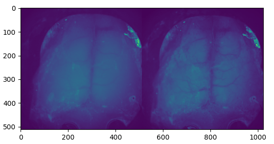
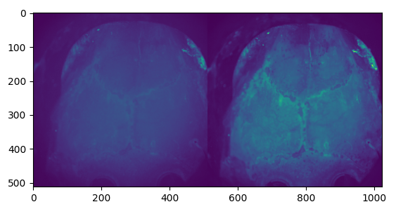
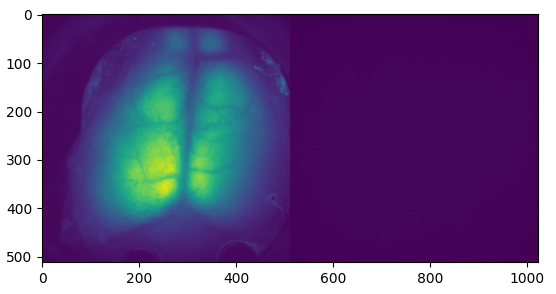
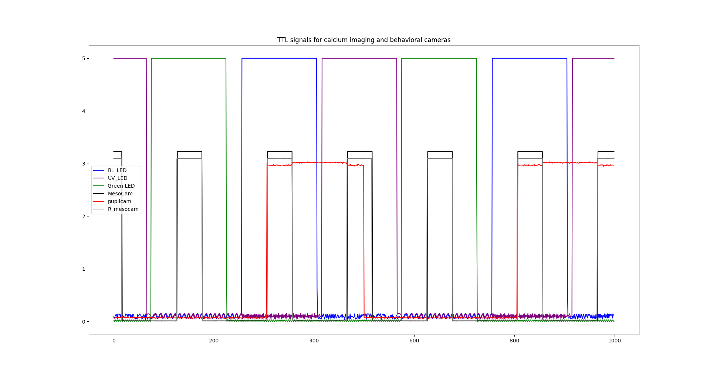

# Notes concerning the benisty_2022 conversion

## Raw Imaging
### Method description from [Benisty 2024](https://www.nature.com/articles/s41593-023-01498-y):
**Mesoscopic imaging**
Widefield mesoscopic calcium imaging was performed using a Zeiss Axiozoom with a 1×, 0.25 NA objective with a 56 mm working distance (Zeiss). Epifluorescent excitation was provided by an LED bank (Spectra X Light Engine, Lumencor) using two output wavelengths: 395/25 (isosbestic for GRABACh3.0) and 575/25 nm (jRCaMP1b). Emitted light passed through a dual camera image splitter (TwinCam, Cairn Research) then through either a 525/50 (GRABACh3.0) or 630/75 (jRCaMP1b) emission filter (Chroma) before it reached two sCMOS cameras (Orca-Flash V3, Hamamatsu). Images were acquired at 512×512 resolution after 4× pixel binning, and each channel was acquired at 10 Hz with 20 ms exposure using HCImage software (Hamamatsu).

**Two-photon imaging**
Two-photon imaging was performed using a MOM microscope (Sutter Instruments) coupled to a 16×, 0.8 NA objective (Nikon). Excitation was driven by a Titanium-Sapphire Laser (Mai-Tai eHP DeepSee, Spectra-Physics) tuned to 920 nm. Emitted light was collected through a 525/50 filter and a gallium arsenide phosphide photomultiplier tube (Hamamatsu). Images were acquired at 512×512 resolution at 30 Hz using a galvo-resonant scan system controlled by ScanImage software (Vidrio).

**Dual mesoscopic and two-photon imaging**
Dual imaging was carried out using a custom microscope combining a Zeiss Axiozoom (as above) and a Sutter MOM (as above), as described previously 25. To image through the implanted prism, a long-working distance objective (20×, 0.4 NA, Mitutoyo) was used. Frame acquisitions were interleaved with an overall rate of 9.15 Hz, with each cycle alternating sequentially between a 920nm two-photon acquisition (512×512 resolution), a 395/25nm widefield excitation acquisition, and a 470/20nm widefield excitation acquisition. Widefield data were collected through a 525/50nm filter into a sCMOS camera (Orca Fusion, Hamamatsu) at 576×576 resolution after 45× pixel binning with 20ms exposure.

### Method description from [Lohani 2022](https://www.ncbi.nlm.nih.gov/pmc/articles/PMC10661869/):
**Widefield imaging**
Widefield calcium and cholinergic imaging was performed using a Zeiss Axiozoom with a PlanNeoFluar Z 1x, 0.25 numerical aperture objective with a 56 mm working distance. Epifluorescent excitation was provided by an LED bank (Spectra X Light Engine, Lumencor) using three output wavelengths: 395/25, 470/24, and 575/25 nm. Emitted light passed through a dual camera image splitter (TwinCam, Cairn Research) then through either a 525/50 or 630/75 emission filter (Chroma) before it reached two sCMOS cameras (Orca-Flash V3, Hamamatsu). Images were acquired at 512×512 resolution after 4x pixel binning, and each channel was acquired at 10 Hz with 20 ms exposure. Images were saved to a solid-state drive using HCImage software (Hamamatsu).

### Data structure:
- **Each .tif is a single frame of [512,1024], 3 consecutive frames look like this:**




- **Don't have the same structure of metadata extracted with `scanimagetiff_utils.extract_extra_metadata()` and parsed with `scanimagetiff_utils.parse_metadata()`**
```python
with ScanImageTiffReader(tif_file) as reader:
    print(reader.metadata)
```
There is no metadata
```python
with ScanImageTiffReader(tif_file) as reader:
     print(reader.description(0))
```
```     
Created by Hamamatsu Inc.
Fri, 22 Nov 2019 22:19:26 Eastern Standard Time

[ CALIBRATION ]
title = Default
units = Pixels
symbol = Px
factor = 1.000000
magnification = 4.000000
scale_len = 100.000000

[ CAPTURE DEVICE ]
 Camera Type = DUAL_DCAM
 Camera Name = C13440-20C S/N: 301751 S/N: 300073
 Camera Size = 2048x2048
 Bit Depth = 16-Bit
 Binning = 4
 Capture Region = (X0=0, Y0=0, Width=512, Height=512)

[ CAPTURE SETTINGS ]
 eOffset1 = 1600.00
 eCoeff1 = 0.48000
 Exposure1 = 0.020005 s
 eOffset2 = 1600.00
 eCoeff2 = 0.49000
 Exposure2 = 0.020005 s
 Temperature = -6.00

[ CAPTURE TIME ]
 Time_From_Start = 00:05:33.3022
 Time_From_Last = 00:00:00.0360
 ```

 - **.smrx files contain TTL syn signals:**
    ```
    neo_reader.header["signal_channels"]
    
    ('BL_LED', '0', 5000., 'int16', 'Volts', 0.00015259, 0., '0'),
    ('UV_LED', '1', 5000., 'int16', 'Volt', 0.00015259, 0., '1'),
    ('MesoCam', '2', 5000., 'int16', ' Volt', 0.00015259, 0., '2'),
    ('Vis', '3', 5000., 'int16', ' Volt', 0.00015259, 0., '3'),
    ('wheel', '4', 5000., 'int16', ' Volt', 0.00015259, 0., '4'),
    ('airpuff', '5', 5000., 'int16', ' Volt', 0.00015259, 0., '5'),
    ('pupilcam', '6', 5000., 'int16', ' Volt', 0.00015259, 0., '6'),
    ('R_mesocam', '7', 5000., 'int16', 'Volt', 0.00015259, 0., '7'),
    ('Green LED', '8', 5000., 'int16', ' Volt', 0.00015259, 0., '8'),
    ('LFP', '9', 5000., 'int16', '', 0.00015259, 0., '9'),
    ```
    sometimes: 'Volts', ' Volt' or 'Volt'

    Using CedRecordingExtractor we can get the TTL traces
    

    With 'MesoCam' channel we can alligned the raw imaging frames to the Spike2 output.

    Then using the 'BL_LED', 'UV_LED' and 'Green LED' we can separate the three imaging streams.

### Imaging metadata 
...