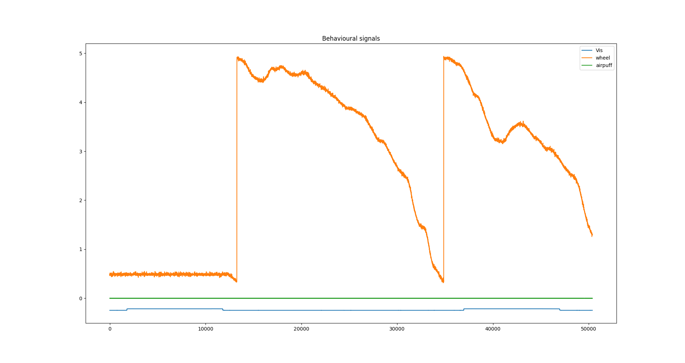

# Notes concerning the benisty_2022 conversion
* dual mesoscopic and 2-photon imaging data, .tiff files with ScanImage format (custom microscope) --> only mesoscopic shared ([Raw Imaging](#raw-imaging))
* output for rigid transformation, hemodynamic corrections, and filtering --> missing
* ROI segmentation (functional parcellation with Local Selective Spectral Clustering) --> missing
* Wheel motion, acquired with a magnetic angle sensor (Digikey), .smrx files Spike2 output format. --> ([Wheel motion](#wheel-motion))
* Face motion (including the pupil and whiskers), imaged with a miniature CMOS camera using FlyCam2 software (Flir).
* Face movements and pupil dilation, .mat files with FaceMap output format ([Facemap output](#facemap-output))
* Visual stimulus pattern, .csv file ([Visual stimulation](#visual-stimulation))
* Synchronization signals, TTL pulses triggered by the different systems and recorded by the electrophysiology system (here used just for synch purpose), Spike2 output format. ([TTL signals](#ttl-signals))

## Raw Imaging 
### Method description from [Benisty 2024](https://www.nature.com/articles/s41593-023-01498-y):
**Mesoscopic imaging**
Widefield mesoscopic calcium imaging was performed using a Zeiss Axiozoom with a 1×, 0.25 NA objective with a 56 mm working distance (Zeiss). Epifluorescent excitation was provided by an LED bank (Spectra X Light Engine, Lumencor) using two output wavelengths: 395/25 (isosbestic for GRABACh3.0) and 575/25 nm (jRCaMP1b). Emitted light passed through a dual camera image splitter (TwinCam, Cairn Research) then through either a 525/50 (GRABACh3.0) or 630/75 (jRCaMP1b) emission filter (Chroma) before it reached two sCMOS cameras (Orca-Flash V3, Hamamatsu). Images were acquired at 512×512 resolution after 4× pixel binning, and each channel was acquired at 10 Hz with 20 ms exposure using HCImage software (Hamamatsu).

**Two-photon imaging**
Two-photon imaging was performed using a MOM microscope (Sutter Instruments) coupled to a 16×, 0.8 NA objective (Nikon). Excitation was driven by a Titanium-Sapphire Laser (Mai-Tai eHP DeepSee, Spectra-Physics) tuned to 920 nm. Emitted light was collected through a 525/50 filter and a gallium arsenide phosphide photomultiplier tube (Hamamatsu). Images were acquired at 512×512 resolution at 30 Hz using a galvo-resonant scan system controlled by ScanImage software (Vidrio).

**Dual mesoscopic and two-photon imaging**
Dual imaging was carried out using a custom microscope combining a Zeiss Axiozoom (as above) and a Sutter MOM (as above), as described previously 25. To image through the implanted prism, a long-working distance objective (20×, 0.4 NA, Mitutoyo) was used. Frame acquisitions were interleaved with an overall rate of 9.15 Hz, with each cycle alternating sequentially between a 920nm two-photon acquisition (512×512 resolution), a 395/25nm widefield excitation acquisition, and a 470/20nm widefield excitation acquisition. Widefield data were collected through a 525/50nm filter into a sCMOS camera (Orca Fusion, Hamamatsu) at 576×576 resolution after 45× pixel binning with 20ms exposure.

### Method description from [Lohani 2022](https://www.ncbi.nlm.nih.gov/pmc/articles/PMC10661869/):
**Widefield imaging**
Widefield calcium and cholinergic imaging was performed using a Zeiss Axiozoom with a PlanNeoFluar Z 1x, 0.25 numerical aperture objective with a 56 mm working distance. Epifluorescent excitation was provided by an LED bank (Spectra X Light Engine, Lumencor) using three output wavelengths: 395/25, 470/24, and 575/25 nm. Emitted light passed through a dual camera image splitter (TwinCam, Cairn Research) then through either a 525/50 or 630/75 emission filter (Chroma) before it reached two sCMOS cameras (Orca-Flash V3, Hamamatsu). Images were acquired at 512×512 resolution after 4x pixel binning, and each channel was acquired at 10 Hz with 20 ms exposure. Images were saved to a solid-state drive using HCImage software (Hamamatsu).

### Data structure:
- **Each .tif is a single frame of [512,1024], 3 consecutive frames look like this:**


- **Don't have the same structure of metadata extracted with `scanimagetiff_utils.extract_extra_metadata()` and parsed with `scanimagetiff_utils.parse_metadata()`**
```python
with ScanImageTiffReader(tif_file) as reader:
    print(reader.metadata)
```
There is no metadata
```python
with ScanImageTiffReader(tif_file) as reader:
     print(reader.description(0))
```
```     
Created by Hamamatsu Inc.
Fri, 22 Nov 2019 22:19:26 Eastern Standard Time

[ CALIBRATION ]
title = Default
units = Pixels
symbol = Px
factor = 1.000000
magnification = 4.000000
scale_len = 100.000000

[ CAPTURE DEVICE ]
 Camera Type = DUAL_DCAM
 Camera Name = C13440-20C S/N: 301751 S/N: 300073
 Camera Size = 2048x2048
 Bit Depth = 16-Bit
 Binning = 4
 Capture Region = (X0=0, Y0=0, Width=512, Height=512)

[ CAPTURE SETTINGS ]
 eOffset1 = 1600.00
 eCoeff1 = 0.48000
 Exposure1 = 0.020005 s
 eOffset2 = 1600.00
 eCoeff2 = 0.49000
 Exposure2 = 0.020005 s
 Temperature = -6.00

[ CAPTURE TIME ]
 Time_From_Start = 00:05:33.3022
 Time_From_Last = 00:00:00.0360
 ```

### Imaging metadata (from Lohani paper)
- Custom miscroscope: see description in the methods
- stimulation wavelengths for the three optical channel: Imaging was performed by strobing 575 nm (jRCaMP1b), 470 nm (ACh3.0) and 395 nm (control)
excitation light
- emission filters: 525/50 or 630/75 (Chroma)
- image dimension: 512×512 
- indicators: Here, we use dual-color mesoscopic imaging of the red-fluorescent calcium indicator jRCaMP1b36 and the green-fluorescent ACh indicator ACh3.0 across the entire dorsal neocortex of the awake mouse to quantify the relationships between behavioral state, cortical activity and cholinergic signaling.

## TTL signals
**.smrx files contain TTL syn signals:**

```
neo_reader.header["signal_channels"]

('BL_LED', '0', 5000., 'int16', 'Volts', 0.00015259, 0., '0'),
('UV_LED', '1', 5000., 'int16', 'Volt', 0.00015259, 0., '1'),
('MesoCam', '2', 5000., 'int16', ' Volt', 0.00015259, 0., '2'),
('Vis', '3', 5000., 'int16', ' Volt', 0.00015259, 0., '3'),
('wheel', '4', 5000., 'int16', ' Volt', 0.00015259, 0., '4'),
('airpuff', '5', 5000., 'int16', ' Volt', 0.00015259, 0., '5'),
('pupilcam', '6', 5000., 'int16', ' Volt', 0.00015259, 0., '6'),
('R_mesocam', '7', 5000., 'int16', 'Volt', 0.00015259, 0., '7'),
('Green LED', '8', 5000., 'int16', ' Volt', 0.00015259, 0., '8'),
('LFP', '9', 5000., 'int16', '', 0.00015259, 0., '9'),
```

sometimes: 'Volts', ' Volt' or 'Volt'

Using CedRecordingExtractor we can get the TTL traces


With 'MesoCam' or 'R_mesocam' channel we can alligned the raw imaging frames to the Spike2 output.

Then using the 'BL_LED', 'UV_LED' and 'Green LED' we can separate the three imaging streams.


...

## Behavior
### Method description from [Benisty 2024](https://www.nature.com/articles/s41593-023-01498-y):
#### Wheel motion
All imaging was performed in awake, behaving mice that were head-fixed so that they could freely run on a cylindrical wheel. A magnetic angle sensor (Digikey) attached to the wheel continuously monitored wheel motion. Mice received at least three wheel-training habituation sessions before imaging to ensure consistent running bouts. During widefield imaging sessions, the face (including the pupil and whiskers) was illuminated with an IR LED bank and imaged with a miniature CMOS camera (Blackfly s-USB3, Flir) with a frame rate of 10 Hz using FlyCam2 software (Flir).


#### Visual stimulation
For visual stimulation experiments, sinusoidal drifting gratings (2 Hz, 0.04 cycles/degree) with varied contrast were generated using custom-written functions based on Psychtoolbox in Matlab and presented on an LCD monitor at a distance of 20 cm from the right eye. Stimuli were presented for 2 seconds with a 5 second inter-stimulus interval.

**from .csv example file** 
Need a README to interpret this

```python
      50  0  2  0.04  2.1  20  667.97  317.97  932.03  582.03  5  1
0      5  0  2  0.04    2  20  667.97  317.97  932.03  582.03  5  1
1     10  0  2  0.04    2  20  667.97  317.97  932.03  582.03  5  1
2     50  0  2  0.04    2  20  667.97  317.97  932.03  582.03  5  1
3     10  0  2  0.04    2  20  667.97  317.97  932.03  582.03  5  1
4     50  0  2  0.04    2  20  667.97  317.97  932.03  582.03  5  1
..   ... .. ..   ...  ...  ..     ...     ...     ...     ... .. ..
294   20  0  2  0.04    2  20  667.97  317.97  932.03  582.03  5  1
295    5  0  2  0.04    2  20  667.97  317.97  932.03  582.03  5  1
296  100  0  2  0.04    2  20  667.97  317.97  932.03  582.03  5  1
297  100  0  2  0.04    2  20  667.97  317.97  932.03  582.03  5  1
298  100  0  2  0.04    2  20  667.97  317.97  932.03  582.03  5  1

[299 rows x 12 columns]
```

### Facemap output
Pupil diameter and facial movements were extracted from face videography using FaceMap. 
For subsequent analysis, facial movement is defined as the the first component of FaceMap-based decomposition (500 components total for each ROI?). Singular value decomposition (SVD) was applied to the face movie to extract the principal components (PCs) explaining the distinct movements apparent on the mouse’s face. 
Wheel position was obtained from a linear angle detector attached to the wheel axle by unwrapping the temporal phase and then computing the traveled distance (cm). Locomotion speed was computed as the differential of the smoothed distance (cm/sec) using a 0.4 second window. Epochs of sustained locomotion and quiescence were extracted using change-point detection as described 14. High/low Pupil and Face epochs were extracted from within quiescence segments where z-score normalized values exceeded high/low thresholds of 60%/40% quantiles.

**[FaceMap MATLAB output (from documentation):](https://github.com/MouseLand/facemap/blob/main/docs/svd_matlab_tutorial.md)**
- _nX,nY_: cell arrays of number of pixels in X and Y in each video taken simultaneously
- _sc_: spatial downsampling constant used
- _ROI_: [# of videos x # of areas] - areas to be included for multivideo SVD (in downsampled reference)
- _eROI_: [# of videos x # of areas] - areas to be excluded from multivideo SVD (in downsampled reference)
- _locROI_: location of small ROIs (in order running, ROI1, ROI2, ROI3, pupil1, pupil2); in downsampled reference
- _ROIfile_: in which movie is the small ROI
- _plotROIs_: which ROIs are being processed (these are the ones shown on the frame in the GUI)
- _files_: all the files you processed together
- _npix_: array of number of pixels from each video used for multivideo SVD
- _tpix_: array of number of pixels in each view that was used for SVD processing
- _wpix_: cell array of which pixels were used from each video for multivideo SVD
- _avgframe_: [sum(tpix) x 1] average frame across videos computed on a subset of frames
- _avgmotion_: [sum(tpix) x 1] average frame across videos computed on a subset of frames
- _motSVD_: cell array of motion SVDs [components x time] (in order: multivideo, ROI1, ROI2, ROI3)
- _uMotMask_: cell array of motion masks [pixels x time]
- _runSpeed_: 2D running speed computed using phase correlation [time x 2]
- _pupil_: structure of size 2 (pupil1 and pupil2) with 3 fields: area, area_raw, and com (in 5_vi_stim→ raw_area and area are the same)
- _thres_: pupil sigma used (The pupil is then defined as an ellipse sigma standard deviations away from the center-of-mass )
- _saturation_: saturation levels (array in order running, ROI1, ROI2, ROI3, pupil1, pupil2); only saturation levels for pupil1 and pupil2 are used in the processing, others are just for viewing ROIs

**From example files:**
- _ROI_:
- _ROIfile_:
- _avgframe_:
- _avgmot_:
- _avgmotion_:
- _eROI_:
- _files_:
- _locROI_:
- _motSVD_:
- _nX_: 
- _nY_: 
- _nframes_:
- _npix_:
- _plotROIs_:
- _pupil_:
- _rootfolder_: extra
- _saturation_:
- _sc_:
- _thres_:
- _tpix_:
- _uMotMask_:
- _useGPU_: extra
- _wpix_:

##Lab Code
* [Benisty 2024](https://github.com/cardin-higley-lab/Benisty_Higley_2023)
* [Lohani 2022](https://github.com/cardin-higley-lab/Lohani_Moberly_et_al_2022)