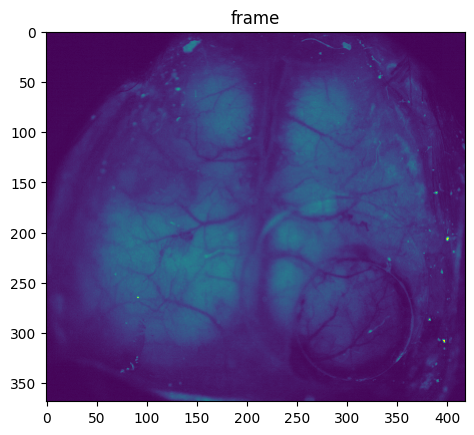

# Notes concerning the benisty_2024 conversion
* dual mesoscopic and 2-photon imaging data, .tiff files with ScanImage format (custom microscope) --> only mesoscopic shared ([Raw Imaging](#raw-imaging))
* output for rigid transformation, hemodynamic corrections, and filtering 
* ROI segmentation (functional parcellation with Local Selective Spectral Clustering)

## Raw Imaging 
### Method description from [Benisty 2024](https://www.nature.com/articles/s41593-023-01498-y):
**Mesoscopic imaging**
Widefield mesoscopic calcium imaging was performed using a Zeiss Axiozoom with a 1×, 0.25 NA objective with a 56 mm working distance (Zeiss). Epifluorescent excitation was provided by an LED bank (Spectra X Light Engine, Lumencor) using two output wavelengths: 395/25 (isosbestic for GRABACh3.0) and 575/25 nm (jRCaMP1b). Emitted light passed through a dual camera image splitter (TwinCam, Cairn Research) then through either a 525/50 (GRABACh3.0) or 630/75 (jRCaMP1b) emission filter (Chroma) before it reached two sCMOS cameras (Orca-Flash V3, Hamamatsu). Images were acquired at 512×512 resolution after 4× pixel binning, and each channel was acquired at 10 Hz with 20 ms exposure using HCImage software (Hamamatsu).

**Two-photon imaging**
Two-photon imaging was performed using a MOM microscope (Sutter Instruments) coupled to a 16×, 0.8 NA objective (Nikon). Excitation was driven by a Titanium-Sapphire Laser (Mai-Tai eHP DeepSee, Spectra-Physics) tuned to 920 nm. Emitted light was collected through a 525/50 filter and a gallium arsenide phosphide photomultiplier tube (Hamamatsu). Images were acquired at 512×512 resolution at 30 Hz using a galvo-resonant scan system controlled by ScanImage software (Vidrio).

**Dual mesoscopic and two-photon imaging**
Dual imaging was carried out using a custom microscope combining a Zeiss Axiozoom (as above) and a Sutter MOM (as above), as described previously. To image through the implanted prism, a long-working distance objective (20×, 0.4 NA, Mitutoyo) was used. Frame acquisitions were interleaved with an overall rate of 9.15 Hz, with each cycle alternating sequentially between a 920nm two-photon acquisition (512×512 resolution), a 395/25nm widefield excitation acquisition, and a 470/20nm widefield excitation acquisition. Widefield data were collected through a 525/50nm filter into a sCMOS camera (Orca Fusion, Hamamatsu) at 576×576 resolution after 45× pixel binning with 20ms exposure.


### Data structure:
- **2p only data** 
    Each .tif is a trial of N frames of [512,512] --> ScanImageMultiFileImagingInterface working 
- **1p data in dual acquisition modality**
    Each .tif is a trial of 12000 frames of [369,418] (why different dims wrt the paper?) --> MultiFileMultiPlaneImagingExtractor needed.
    Frames are acquired cycling over blue (excitation filter 470/20) and violet(excitation filter 395/25) light (same emission filter at 525/50):
    
    

    ```
    description: 
        ImageJ=1.52v
        images=12000
        slices=12000
        unit=inch
        loop=false
        min=1447.0
        max=7936.0
    ```
    However, these are the .tiff stacks of the same type of acquisition for Lohani22.


- **2p data in dual acquisition modality**
    Each .tif is a trial of ? frames of ? --> ScanImageMultiFileImagingInterface working 
    
    


### Imaging metadata (from Benisty paper)
- Custom miscroscope: see description in the methods
- stimulation wavelengths for the three optical channel: Imaging was performed by strobing 575 nm (jRCaMP1b), 470 nm (ACh3.0) and 395 nm (control)
excitation light
- emission filters: 525/50 or 630/75 (Chroma)
- image dimension: 512×512 
- indicators: Here, we use dual-color mesoscopic imaging of the red-fluorescent calcium indicator jRCaMP1b36 and the green-fluorescent ACh indicator ACh3.0 across the entire dorsal neocortex of the awake mouse to quantify the relationships between behavioral state, cortical activity and cholinergic signaling.

##Lab Code
* [Benisty 2024](https://github.com/cardin-higley-lab/Benisty_Higley_2023)